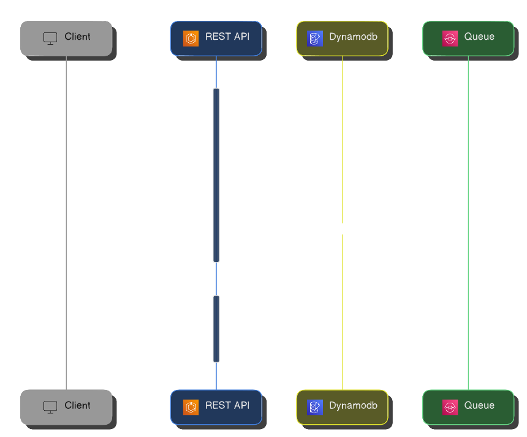
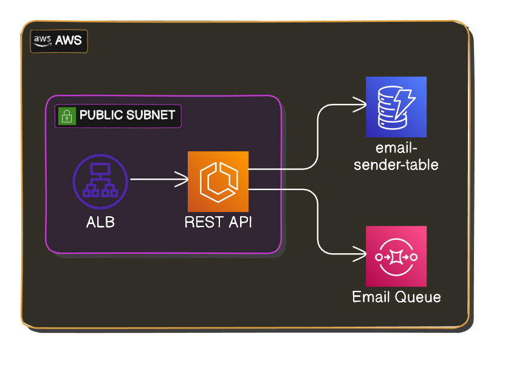

# REST API

A REST API that exposes endpoints for general operations.

See on **[GitHub](https://github.com/itsadeadh2/email-sender)**

## Stack

**[Python](https://www.python.org/) | [Flask](https://flask.palletsprojects.com/en/3.0.x/) | [DynamoDB](https://aws.amazon.com/pm/dynamodb/) | [ECS](https://aws.amazon.com/ecs/)**

## Purpose

This rest api provides some endpoints that are used by the **[commodore landing](./commodore-landing.md)** to provide functionality.

## Responsibilities

:::info[Swagger Docs]
This api also has a swagger page for more in-depth endpoint documentation. 
You can check it out **[here](https://itsadeadh2.com/swagger-ui)**
:::

### Send Email

Upon receiving a valid email via a `POST` request, the Email Sender places the email on an SQS Queue to be processed by the **[Email Worker](./Workers/email-worker.md)**.

### Store User Emails

Upon receiving a valid email via a `POST` request, the Email Sender stores the email in a DynamoDB table.

### Return Emails (WIP)

Upon receiving a `GET` request, the Email Sender returns the stored emails.

## Infrastructure

