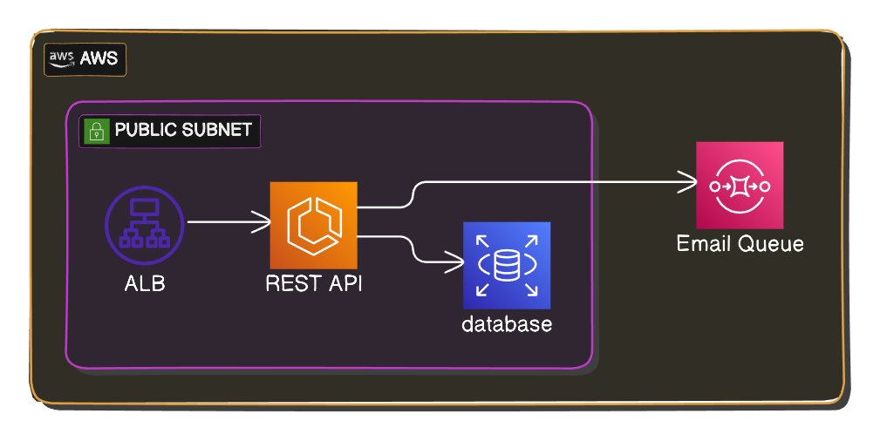

# Infrastructure

Explore the resources, pipelines, and integrations of the project.

## Cloud Provider

This project is hosted on **AWS**, utilizing the following resources:

- **CloudFormation**: Infrastructure as Code (IaC) tool.
- **Elastic Container Registry (ECR)**: Private Docker registry.
- **Elastic Container Service (ECS)**: Container management.
- **CloudWatch**: Logging service.
- **DynamoDB**: Database for persistence.
- **Elastic Load Balancer (ELB)**: Routing, load balancing, and SSL termination.
- **VPC and Public Subnet**: Networking components.
- **Route 53**: Domain management service.

All these resources are automatically created and configured using a set of **CloudFormation** templates.

## CI/CD

The CI/CD pipeline for this project is managed by **GitHub Actions**. It handles:

- Testing
- Linting
- Building
- Deploying the infrastructure and application to AWS