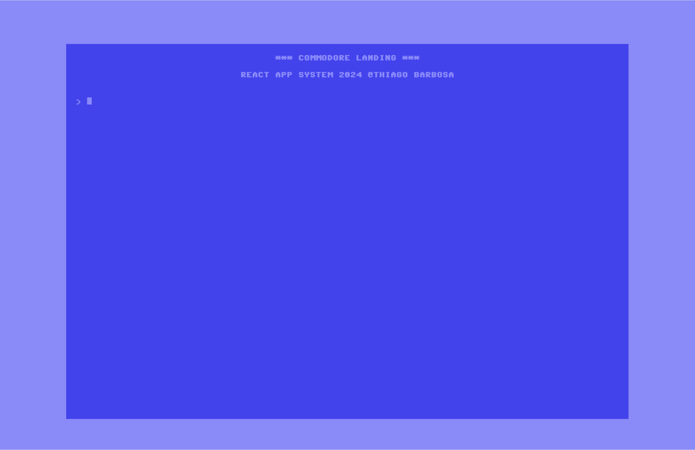

# Commodore Landing

SPA landing page made with React.

See on **[GitHub](https://github.com/itsadeadh2/commodore-landing)**

## Stack

**[Node.js](https://nodejs.org/pt) | [React](https://react.dev/) | [JavaScript](https://developer.mozilla.org/pt-BR/docs/Web/JavaScript) | [GitHub Pages](https://pages.github.com/)**

## Purpose

Commodore Landing serves as a landing page for users to interact with the **[API Gateway](./api-gateway.md)**.



## Responsibilities

Commodore Landing is responsible for receiving user requests via an "emulated" terminal.

The terminal works by accepting a `rootcommand` followed by an `action` where applicable.  
For example:
```sh
contact foo@bar.com
# rootcommand: contact
# action: foo@bar.com

help
# rootcommand: help
# action: None
```

## Infrastructure

Commodore Landing was initially hosted on AWS.

It was built into a **Docker** image, uploaded to **ECR**, and then deployed on an **ECS Service** behind an **Application Load Balancer**.

This setup worked well but was overkill.

While I was pleased to successfully deploy it, maintaining that setup would be costly and result in longer deployments.

Therefore, I decided to migrate to GitHub Pages, where it is **[currently deployed](https://itsadeadh2.github.io/commodore-landing/)**.
