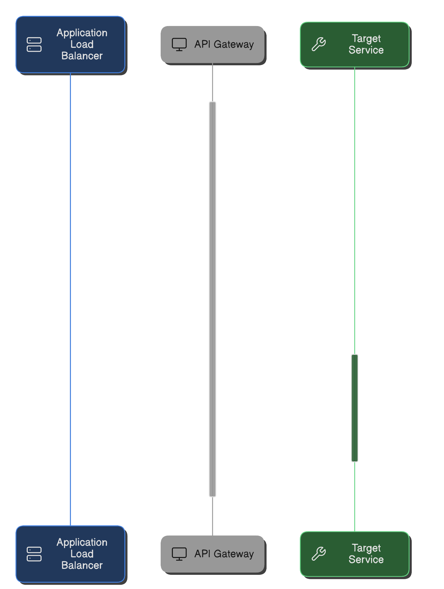
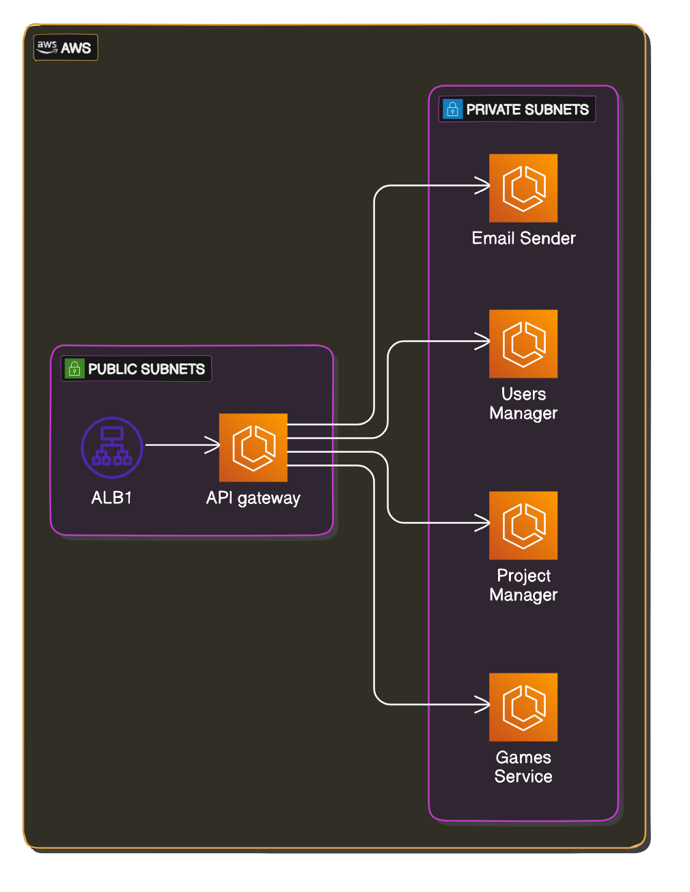

# API Gateway

Manages incoming traffic and routes it to the appropriate services.

See on **[GitHub](https://github.com/itsadeadh2/api-gateway)**

## Stack

**[Node.js](https://nodejs.org/pt) | [Express](https://expressjs.com/) | [JavaScript](https://developer.mozilla.org/pt-BR/docs/Web/JavaScript) | [ECS](https://aws.amazon.com/ecs/)**

:::info[Why not AWS API Gateway?]
Yes, I'm aware that there are several out-of-the-box solutions for creating API Gateways, including AWS API Gateway. The main reason I chose to implement this one myself is to gain a better understanding of the challenges and issues that an API Gateway can face.
:::

## Purpose

The API Gateway routes traffic from the specified Application Load Balancer to the appropriate **[services](/category/services)**

## Responsibilities

### Route Traffic

The API Gateway routes traffic to the appropriate services based on the request URI.

### Authorization and Authentication

The API Gateway enforces user authentication and authorization. The keyword here is **enforcing**; it is not responsible for creating or managing them.

### Parsing

The API Gateway parses HTTP requests to other necessary formats if needed. It might need to parse the request to a Lambda call, an RPC call, or to a query entry in Redis/SQS. If there are any payload errors regarding the input, the API Gateway will catch them.

### Rate Limiting or Other Limitations

The API Gateway applies the desired rate limiting policy to a given endpoint or any other kind of limitation that might be added to a specific route.

## Infrastructure
