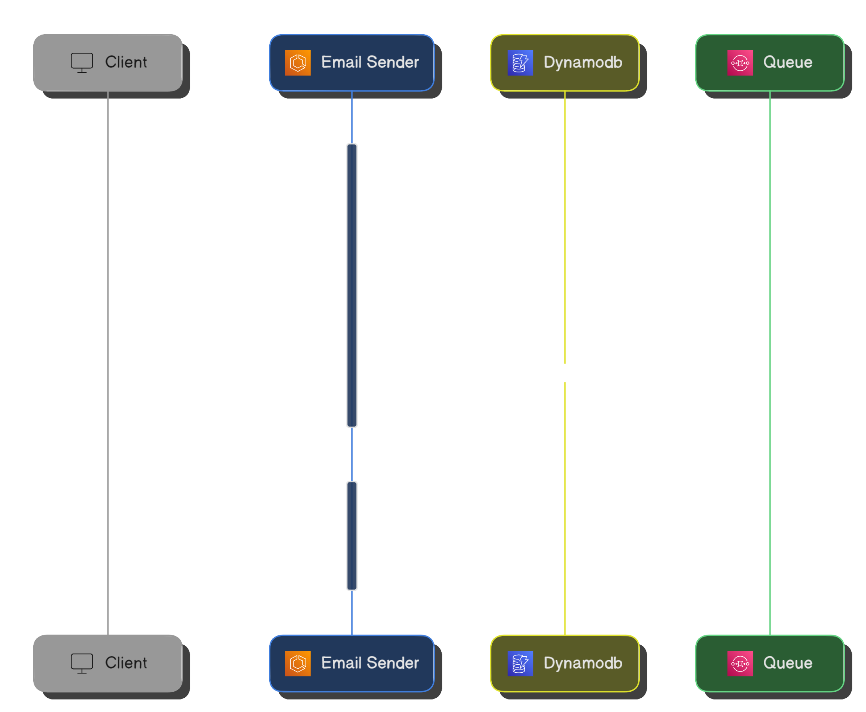
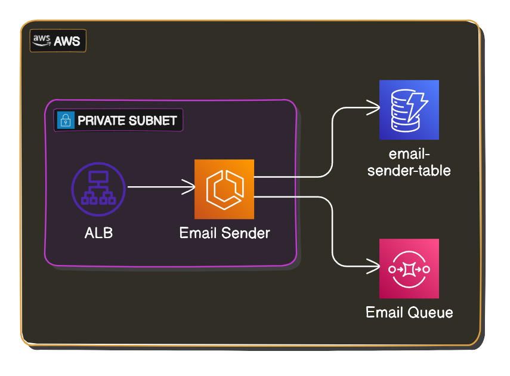

# Email Sender

A REST API that exposes endpoints for email operations.

See on **[GitHub](https://github.com/itsadeadh2/email-sender)**

## Stack

**[Python](https://www.python.org/) | [Flask](https://flask.palletsprojects.com/en/3.0.x/) | [DynamoDB](https://aws.amazon.com/pm/dynamodb/) | [ECS](https://aws.amazon.com/ecs/)**

:::info[Why not a lambda?]
The Email Sender was initially set up as a Lambda function due to its simplicity, having only one resource (`/email`).

I didn't anticipate a high volume of requests for this service, so using a Lambda function seemed cost-effective since it would only run when there was a request.

However, using a Lambda function introduced significant latency.

Requests took up to 5 seconds to complete on *cold starts* and around 900ms on *warm starts*.

Therefore, I decided to switch to a more traditional approach by using an ECS service to run the Email Sender.
:::

## Purpose

The Email Sender service functions as a top-level service working in conjunction with the **[Email Worker](./email-worker.md)** to provide email sending functionality.

## Responsibilities

### Send Email

Upon receiving a valid email via a `POST` request, the Email Sender places the email on an SQS Queue to be processed by the **[Email Worker](./email-worker.md)**.

### Store User Emails

Upon receiving a valid email via a `POST` request, the Email Sender stores the email in a DynamoDB table.

### Return Emails

Upon receiving a `GET` request, the Email Sender returns the stored emails.

## Infrastructure

