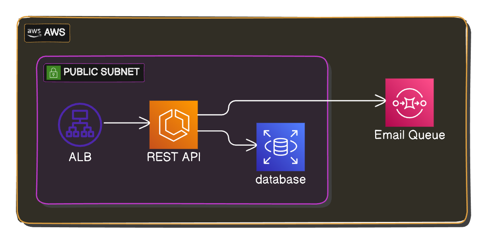

# Infrastructure

Explore the resources, pipelines, and integrations of the project.

## Cloud Provider

This project is hosted on **AWS**, utilizing the following resources:

- **CloudFormation**: Infrastructure as Code (IaC) tool.
- **Elastic Container Registry (ECR)**: Private Docker registry.
- **Elastic Container Service (ECS)**: Container management.
- **CloudWatch**: Logging service.
- **Elastic Load Balancer (ELB)**: Routing, load balancing, and SSL termination.
- **VPC and Public Subnet**: Networking components.
- **Route 53**: Domain management service.

All these resources are automatically created and configured using a set of **CloudFormation** templates.

:::note
Initially this infrastructure had the postgres database deployed on an **AWS RDS** instance.  
That worked like a charm, but it was expensive, so I decided to change the implementation to have 
a container inside the ecs service running a postgresql image.

The container uses an **EFS** file system to persist the postgresql data in case the instance goes down
at for any reason.

This is not ideal, **but** is cheaper, and as a side project, costs are more important than reliability/security at this point.
  :::
## CI/CD

The CI/CD pipeline for this project is managed by **GitHub Actions**. It handles:

- Testing
- Lint checking
- Building
- Deploying the infrastructure and application to AWS